# 双指针

## 双向双指针

解题套路

https://www.bilibili.com/video/BV1Ly4y1871d/?spm_id_from=333.788.videopod.episodes&vd_source=746d8a251a4a658573b141cee21d4f94&p=2

### 167 两数之和

https://www.bilibili.com/video/BV1bP411c7oJ/?spm_id_from=333.337.search-card.all.click&vd_source=746d8a251a4a658573b141cee21d4f94

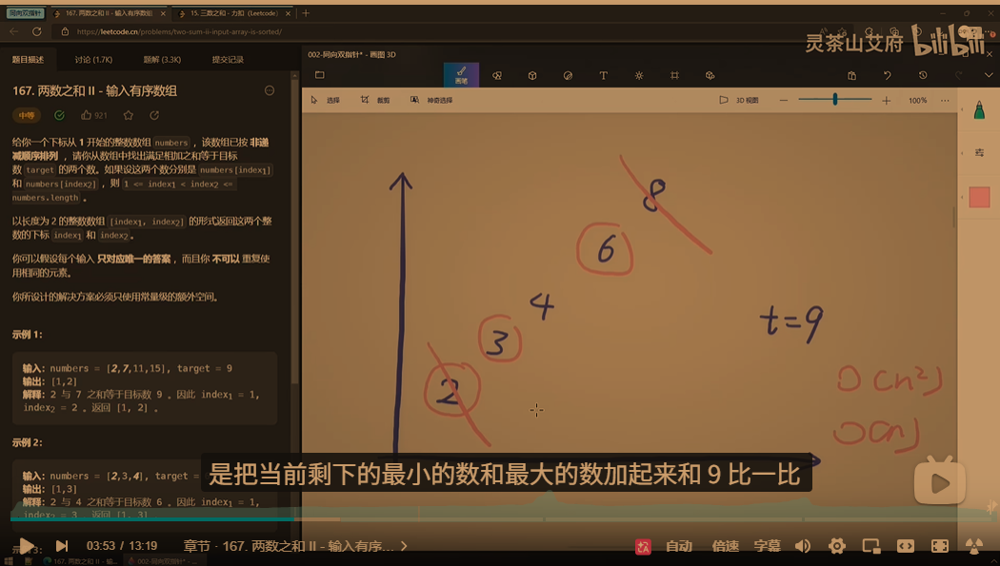

解题思路:有条件（有序数组），定义一个从左的指针和从右的指针，如果两数相加=目标数，返回答案；

如果两数之和大于目标数，因为数组是有序的，那么最右边的数和其他的数相加必定大于目标数，于是把右指针左移；

如果两数之和小于目标数，那么最左边和数和其他数相加必定小于目标数，于是把左指针右移

时间复杂度：O（1）
空间复杂度：O（n） n=数组长度

### 15 三数之和

https://www.bilibili.com/video/BV1bP411c7oJ/?spm_id_from=333.337.search-card.all.click&vd_source=746d8a251a4a658573b141cee21d4f94

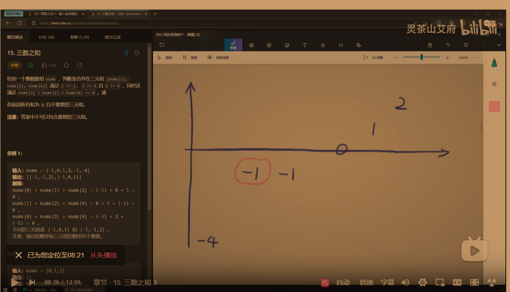先排序，然后第一个数字用for循环中的i 自增来表示，其他两个指针l=i+1，r=数组长度减1

注：重复数字需要跳过

时间复杂度：O(n^2)

空间复杂度：O（1）

### [11. 盛最多水的容器](https://leetcode.cn/problems/container-with-most-water/)

https://www.bilibili.com/video/BV1Qg411q7ia?spm_id_from=333.788.videopod.sections&vd_source=746d8a251a4a658573b141cee21d4f94

left=0，r=height.length-1，先计算初始面积

然后比较左边和右边的柱子高低，将柱子低的一边向里面移，同时比较面积和初始面积的大小，取大的那一个

### 125 验证回文串

转大小写

定义两个指针 如果不是字母或者数字isLetterOrDigit  就跳过

如果两边相等，继续移动两个指针

如果不相等，就返回false

如果循环结束都没有找到不相等的，就返回true

### 42 接雨水

https://www.bilibili.com/video/BV1Qg411q7ia/?vd_source=746d8a251a4a658573b141cee21d4f94

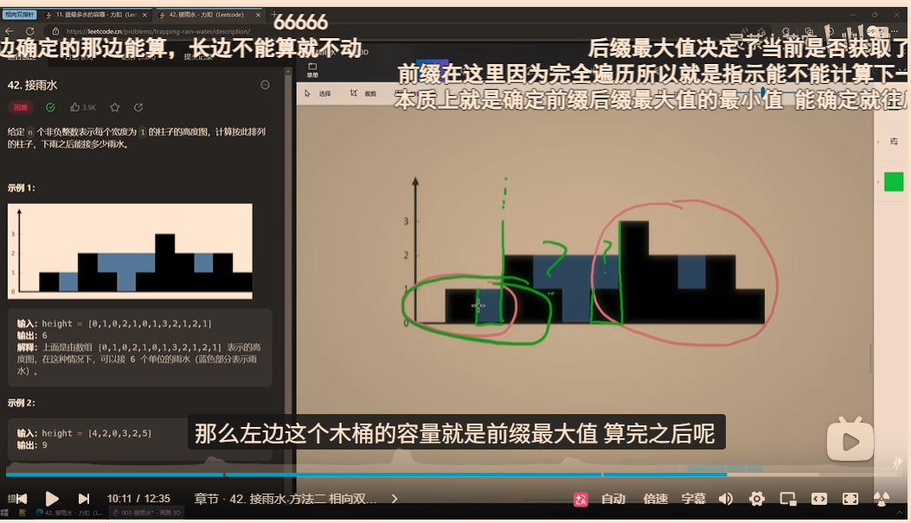

定义两个双向双指针 如果前缀最大值比后缀最大值小， 那么左边这个木桶的容量就是前缀最大值-当前高度 算完之后指针向右扩展


## 同向双指针

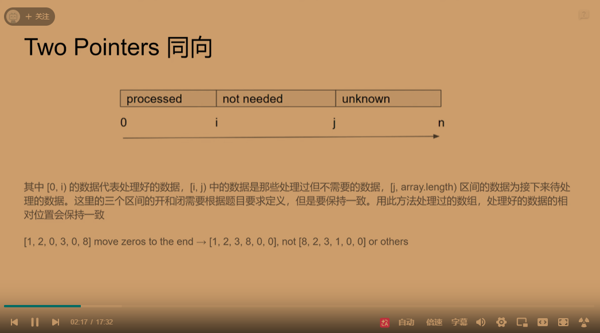


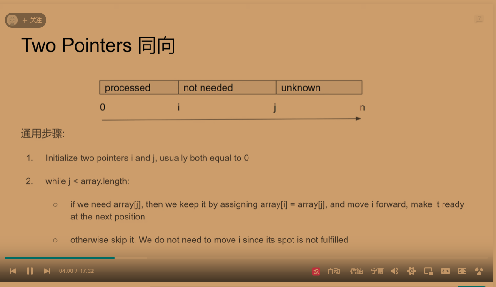

### 283 移动零

https://www.bilibili.com/video/BV1tZtVeUE2o/?spm_id_from=333.1387.search.video_card.click&vd_source=746d8a251a4a658573b141cee21d4f94

解题思路：1.创建两个数组，遍历原数组，非零的放在一个数组，为零的放在另一个数组，但是需要使用额外空间，不符合题目要求

2.相向双指针： 定义一左一右两个指针，当左边是0，右指针非0，将左右指针的元素交换，左指针右移，右指针左移，一直到两个指针相遇,但是会改变数组顺序，不符合题目要求

3.

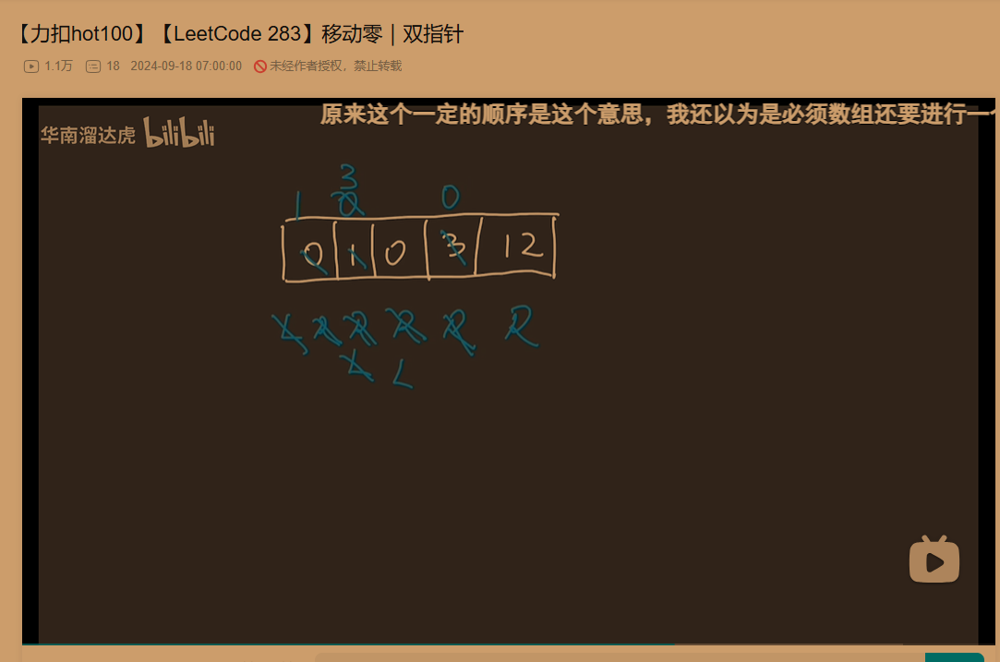

定义两个指针，同时从左往右移，当右指针指向的元素为0，就往右移动右指针，一直到右指针指向的数不为0，将左右指针的元素交换（右指针不为0就交换），左指针右移，右指针右移，直到右指针到达数组的尽头

注意：交换的时候注意顺序

### [392. 判断子序列](https://leetcode.cn/problems/is-subsequence/)


定义快慢两个指针，同时移动

如果子串的字符在父串中，右移慢指针, 如果不在，就右移快指针比较父串中的下一个字母

直到子串遍历完

```
 public boolean isSubsequence(String s, String t) {
        int sl=0;
        int fl=0;
        int son=s.length();
        int father=t.length();
        while(fl<father&&sl<son){
            if (s.charAt(sl)==t.charAt(fl)) {
                sl++;

            }
            fl++;
        }
        return sl==son;//看子串有没有移动到末尾

    }
```


# 数组

### [53. 最大子数组和](https://leetcode.cn/problems/maximum-subarray/)

用动态规划的思路做

```java
public int maxSubArray(int[] nums) {
    int[] f=new int[nums.length];
    f[0]=nums[0];
    int ans= f[0];
    for (int i=1;i<nums.length;i++){
        f[i]=Math.max(f[i-1]+nums[i],nums[i]);
        ans=Math.max(ans,f[i]);
    }
    return ans;
}
```

因为计算 `f[i]` 时只需要使用前一个状态 `f[i - 1]`，不需要保存整个数组：

```java
public int maxSubArray(int[] nums) {
    int f = nums[0];
    int ans = nums[0];

    for (int i = 1; i < nums.length; i++) {
        f = Math.max(f + nums[i], nums[i]);
        ans = Math.max(ans, f);
    }

    return ans;
}
```

时间复杂度是 `O(n)`，空间复杂度从 `O(n)` 降到了 `O(1)`。

### 56 合并区间

先把区间左端点排序

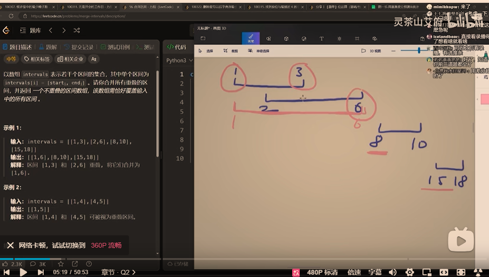

这样,只需要比较当前阶段的左端点是否大于上一个阶段的右端点,如果小于就合并区间,如果大于 上一区间就永远不可能跟剩下的有交集,直接把上一区间加进答案

```java
//把数组按照左区间排序
Arrays.sort(intervals,(a,b)->Integer.compare(a[0],b[0]));
List<int[]> ans=new ArrayList<>();

for (int[] interval : intervals) {
    int size=ans.size();
    //答案为空或当前区间左端点大于上一个区间的右端点 没有交集
    if(ans.isEmpty()||interval[0]>ans.get(size-1)[1]){
        ans.add(interval);
    }else {
        //更新区间
        int[] last = ans.get(size - 1);
        last[1]=Math.max(last[1],interval[1]);
    }
}
return ans.toArray(new int[ans.size()][]);
```

这里有几个写错点:1是这个是一个ArrayList不是二维动态数组,最后需要转换

2是一开始把int size写在循环外面 导致只计算了一次 写在里面才会每次都循环

### 189 轮转数组

https://www.bilibili.com/video/BV13ox5eHE9n/?spm_id_from=333.1387.search.video_card.click&vd_source=746d8a251a4a658573b141cee21d4f94

1.最简单的方法是把原数组+k放到新数组里面,超过数组长度就减去k,但是这样空间复杂度是O(n),如果题目要求用O(1)的空间复杂度的话就不行

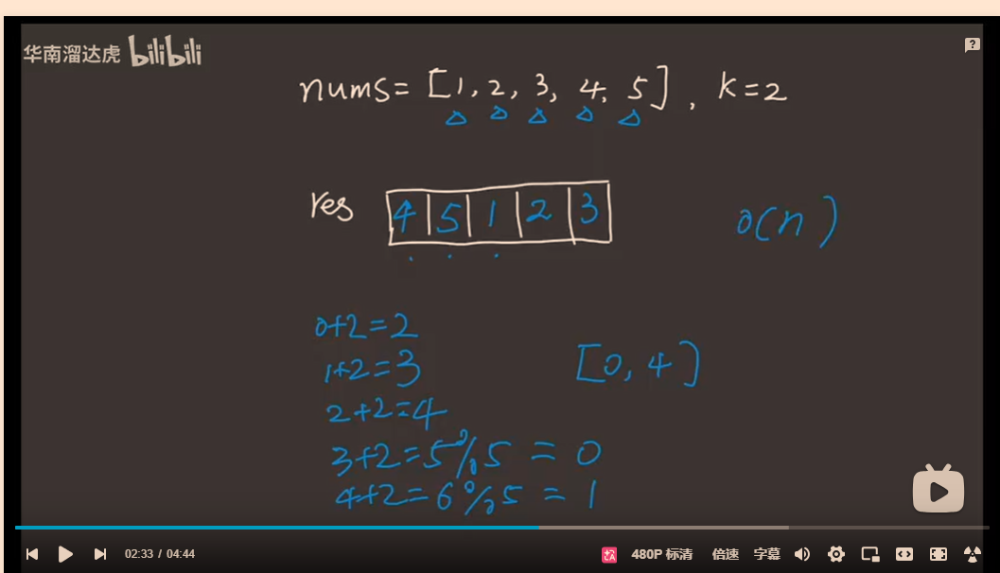

2.O(1)空间复杂度的

现将原数组反转 答案数组就是反转后的数组 前k个数组再反转 后面的数组再反转 

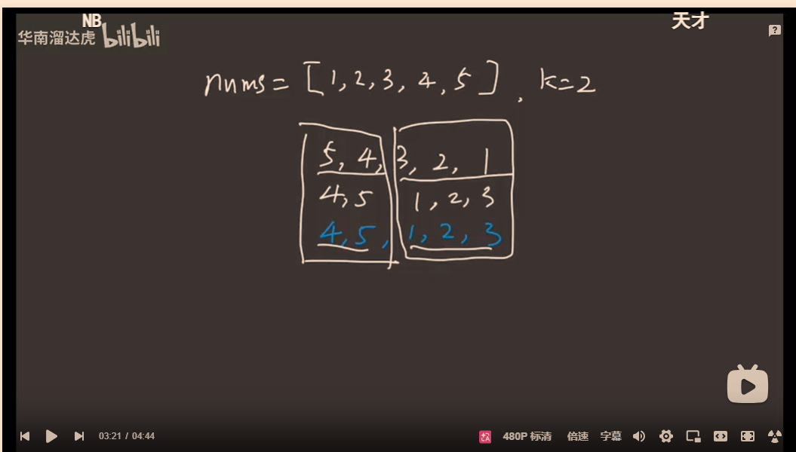

```java
public void rotate(int[] nums, int k) {
    k=k%nums.length;
    reverse(nums,0,nums.length-1);
    reverse(nums,0,k-1);
    reverse(nums,k,nums.length-1);
}

private void reverse(int[] nums,int start,int end){
    while(start<end){
        int temp=nums[start];
        nums[start++]=nums[end];
        nums[end--]=temp;
    }
}
```

### 238  除了自身以外数组的乘积

https://space.bilibili.com/24779699/search?keyword=238

最简单的做法是把数组全都相乘 再除去所在位置的积(为0怎么办?)  但是题目不让用除法

所以用2个数组 前缀积 和后缀积 相乘  但是这样会用到额外空间,优化方法为在原地相乘 

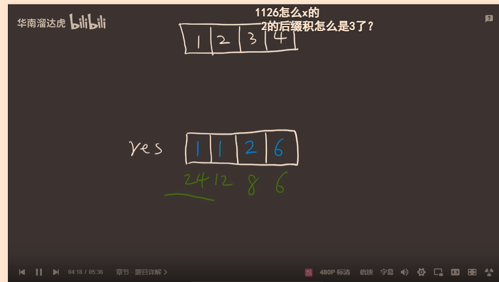

```java
int [] ans=new int [nums.length];
ans[0]=1;
for (int i = 1; i < nums.length; i++) {
    ans[i]=ans[i-1]*nums[i-1];
}
int postpre=1;//注意这里需要使用额外变量记录后缀积
for (int i = nums.length-1; i >= 0; i--) {
    ans[i]=ans[i]*postpre;
    postpre=postpre*nums[i];
}
return ans;
```

### 560 和为K的子数组

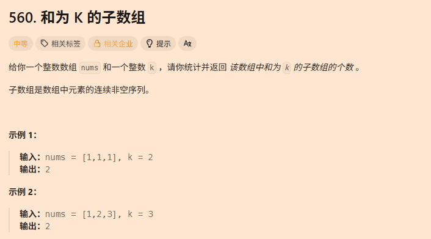

用前缀和+哈希表  

在示例2中  前缀和pre[0]=0 pre[1]=1 pre[2]=3 pre[3]=6  想知道[2,3]的和   就是pre[3]-pre[1]=5

假设当前前缀和为sum 我们希望找到之前某一个前缀和previousSum  使得sum-previousSum=k,移项得 previousSum=sum-k

每次计算出当前前缀和sum后,只要看之前出现过多少次sum-k,就知道有多少个子数组的和等于k

# 滑动窗口

滑动窗口就是像毛毛虫一样

### 209 长度最小的子数组

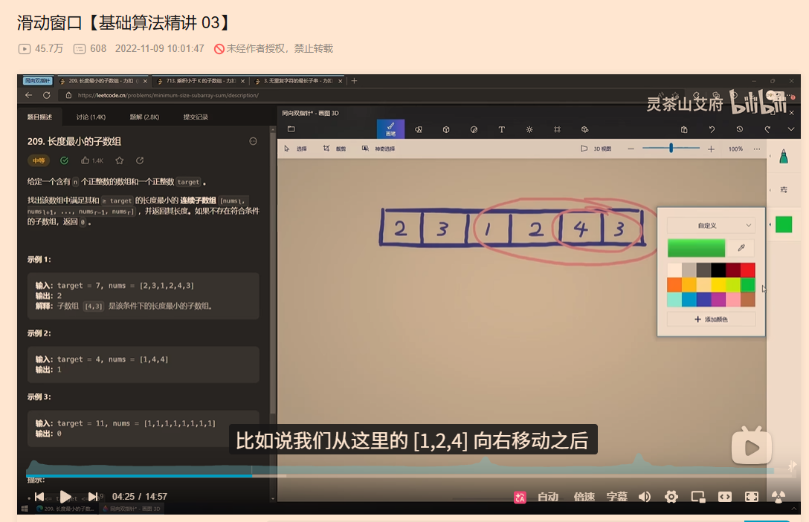

定义一个右端点 当满足要求时 取答案最小值 并且将左端点右移 总和减去左端点那个数

时间复杂度：O(n)

空间复杂度：O(1)

### [3. 无重复字符的最长子串](https://leetcode.cn/problems/longest-substring-without-repeating-characters/)

https://www.bilibili.com/video/BV1hd4y1r7Gq?spm_id_from=333.788.videopod.sections&vd_source=746d8a251a4a658573b141cee21d4f94

定义一个hash set用来检验重复字母

如果窗口内含有重复字母，set中去处该字母，移除窗口左端点字母，缩小窗口

定义一个答案，初始化为0或取最小值，每次取ans和r-l+1（窗口长度）的最大值

时间复杂度：O(n)，其中 n 为 s 的长度。注意 left 至多增加 n 次，所以整个二重循环至多循环 O(n) 次。
空间复杂度：O(∣Σ∣)，其中 ∣Σ∣ 为字符集合的大小，本题中字符均为 ASCII 字符，所以 ∣Σ∣≤128

```
public int lengthOfLongestSubstring(String s) {
    HashSet<Character> set = new HashSet<>();
    int l=0;
    int ans=0;
    char[] charArray = s.toCharArray();
    for(int r = 0; r <charArray.length; r++){
        while (l<r&&set.contains(charArray[r])){//窗口内有重复字母
            set.remove(charArray[l]);   //移除窗口左端点字母
            l++;//缩小窗口
        }
        set.add(charArray[r]);
        ans=Math.max(ans,r-l+1);
    }
    return ans;
}
```

### 438 找到字符串中所有字母异位词

用一个数组统计目标词中每个字母出现的次数  用一个定长的滑动窗口统计  滑动时右指针的字母统计次数+1 左指针减1 字母出现次数相等时把左指针指向的索引加入答案数组

```java
int cntP[]=new int[26];
char[] charArray = p.toCharArray();
//统计p中每个字母出现的次数
for (char c : charArray) {
    cntP[c - 'a']++;
}
List<Integer> ans = new ArrayList<>();
int cntS[]=new int[26];
char[] charArrayS = s.toCharArray();
int length = charArray.length;
for (int r = 0; r < charArrayS.length; r++) {
   //右端点字母进入窗口
    cntS[charArrayS[r]-'a']++;
    int l=r-length+1;
    //窗口长度不足p.length
    if (l<0){
        continue;
    }
    if (Arrays.equals(cntP,cntS)){
        ans.add(l);
    }
    //左端点字母离开窗口  注意窗口进入和出去的顺序
    cntS[charArrayS[l]-'a']--;
}
return ans;
```

# 二分查找

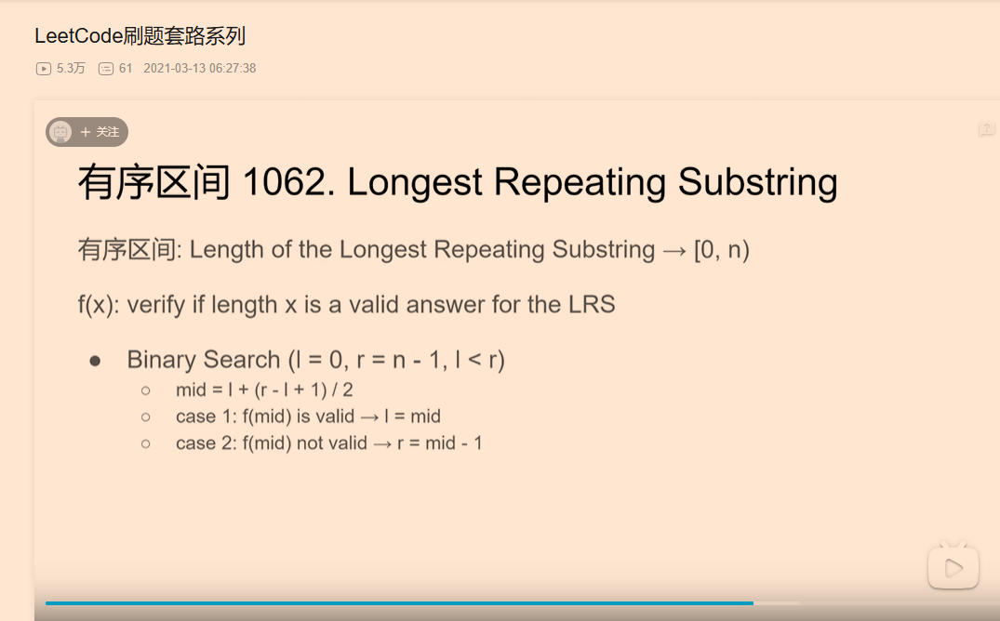

一种时间复杂度为logn的算法，主要用于有序数组

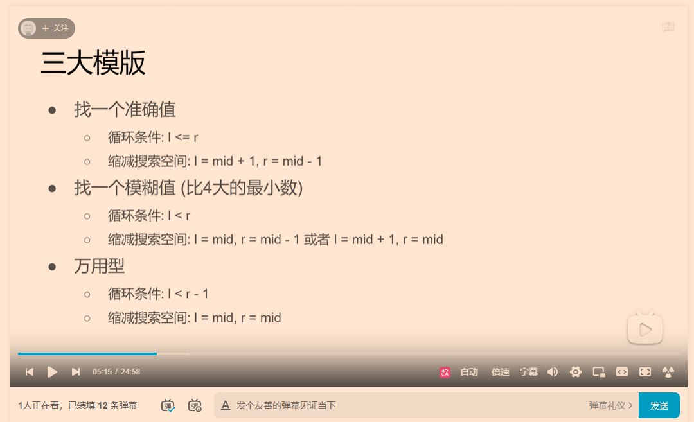

其实我感觉这个就是开闭区间的不同写法，不同的区间临界值不一样

推荐开区间写法：

l：0  r=length（可能有特殊情况）

循环条件：l<r-1

mid=l+（r-l）/2 防止内存溢出  if条件中mid和谁比较需要根据情况灵活判断

缩减条件：l=mid，r=mid

### [153. 寻找旋转排序数组中的最小值](https://leetcode.cn/problems/find-minimum-in-rotated-sorted-array/)

```java
int n=nums.length;
int l=-1;
int r=n-1;
while(l+1<r){
    int mid = l+(r-l)/2;
    if(nums[mid]<nums[n-1]){
        r=mid;
    }else {
        l=mid;
    }
}
return nums[r];
```

### [162. 寻找峰值](https://leetcode.cn/problems/find-peak-element/)

mid和自己两边的数比较

```java
public int findPeakElement(int[] nums) {
    int start = -1;
    int end = nums.length-1;//注意这里的长度要减一
    while(start+1<end){
        int mid =start+ (end-start)/2;
        if(nums[mid]>nums[mid+1]){//这里也可以是等号，但是题目保证了相邻的数不相等，所以可以省略等号
            end = mid;
        }else {
            start = mid;
        }
    }
    return end;
}
```

### 34 在排序数组中查找元素的第一个和最后一个位置

```
public int[] searchRange(int[] nums, int target) {
    int start = lowerBound(nums, target);
    if (start == nums.length || nums[start] != target) {
        return new int[]{-1, -1}; // nums 中没有 target
    }
    // 如果 start 存在，那么 end 必定存在
    int end = lowerBound(nums, target + 1) - 1;
    return new int[]{start, end};
}

// lowerBound 返回最小的满足 nums[i] >= target 的下标 i
// 如果数组为空，或者所有数都 < target，则返回 nums.length
// 要求 nums 是非递减的，即 nums[i] <= nums[i + 1]
private int lowerBound(int[] nums, int target) {
    int left = -1;
    int right = nums.length; // 开区间 (left, right)
    while (left + 1 < right) { // 区间不为空
        // 循环不变量：
        // nums[left] < target
        // nums[right] >= target
        int mid = left + (right - left) / 2;
        if (nums[mid] >= target) {
            right = mid; // 范围缩小到 (left, mid)
        } else {
            left = mid; // 范围缩小到 (mid, right)
        }
    }
    // 循环结束后 left+1 = right
    // 此时 nums[left] < target 而 nums[right] >= target
    // 所以 right 就是第一个 >= target 的元素下标
    return right;
}
```

### [153. 寻找旋转排序数组中的最小值](https://leetcode.cn/problems/find-minimum-in-rotated-sorted-array/)

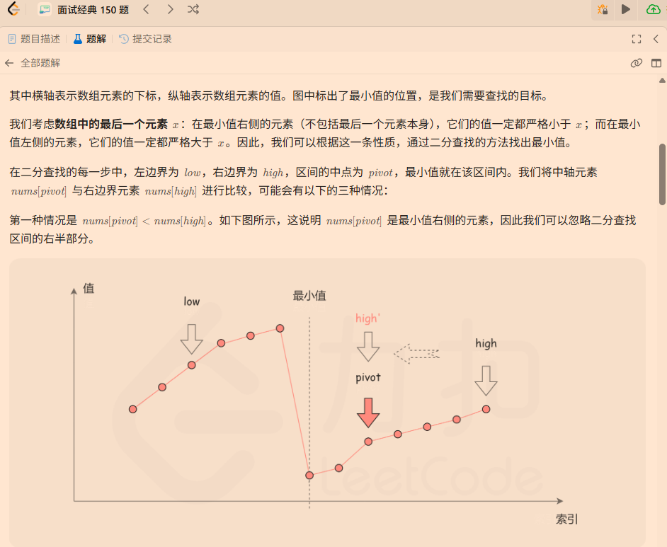

以最右边的数为基准，如果mid小于最右边的数，那么他在右边的线段上，将r=mid，反之l=mid

```
public int findMin(int[] nums) {

    int n=nums.length;
    int l=-1;
    int r=n-1;
    while(l+1<r){
        int mid = l+(r-l)/2;
        if(nums[mid]<nums[n-1]){
            r=mid;
        }else {
            l=mid;
        }
    }
    return nums[r];
}
```

### 33搜索旋转排序数组

```
将数组一分为二，其中一定有一个是有序的，另一个可能是有序，也能是部分有序。
此时有序部分用二分法查找。无序部分再一分为二，其中一个一定有序，另一个可能有序，可能无序。就这样循环. 
```

```java
public int search(int[] nums, int target) {
    int l=-1,r=nums.length;
    while(l<r-1){
        int mid=l+(r-l)/2;
        if(nums[mid]==target){
            return mid;
        }
        // 左半段有序 例如[4 5 6 7 8 1 2] mid是7，左半边456是有序的
        if (nums[l+1]<=nums[mid]) {
            if(nums[l+1]<=target&&target<nums[mid]){
                r=mid;
            }else {
                l=mid;
            }
        }else {
            if (nums[mid]<target&&target<=nums[r-1]) {
                l=mid;
            }else {
                r=mid;
            }
        }
    }
    return -1;
}
```

# 一维动态规划

# 多维动态规划

# 堆

解题套路：
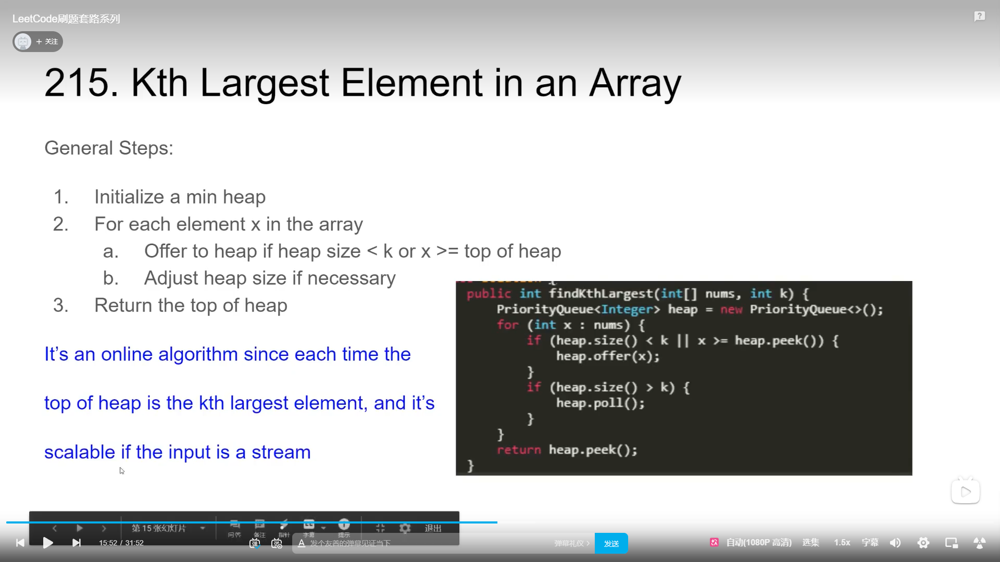

### 215 数组中的第k个最大元素

```java
public int findKthLargest(int[] nums, int k) {
    PriorityQueue<Integer> q = new PriorityQueue<>(k);
    for (int i = 0; i < nums.length; i++) {
        q.offer(nums[i]);
        if (q.size() > k) {
            q.poll();
        }
    }
    return q.poll();
}
```

### 347 前K个高频元素

用map存放元素和出现次数 然后用堆排序 最后取出堆中元素

```java
//用map occurs统计数字出现次数
Map<Integer, Integer> occurs = new HashMap<>();
for (int num : nums) {
    occurs.put(num, occurs.getOrDefault(num, 0) + 1);
}
//用堆获取前k个出现最多的字母 注意：此时是以键值对的形式存入堆  排序是按照键值对的值也就是出现次数
PriorityQueue<Map.Entry<Integer,Integer>> queue = new PriorityQueue<>((a, b) ->a.getValue() - b.getValue());
for (Map.Entry<Integer,Integer> entry : occurs.entrySet()) {
    queue.offer(entry);
    if (queue.size() > k) {
        queue.poll();
    }
}
//遍历堆 取出键值对中的键
int [] ans=new int[k];
for (int i = 0; i < k; i++) {
    ans[i]=queue.poll().getKey();
}
return ans;
```

### 23.合并K个升序链表

https://www.bilibili.com/video/BV1Ly4y1871d?spm_id_from=333.788.videopod.episodes&vd_source=746d8a251a4a658573b141cee21d4f94&p=6

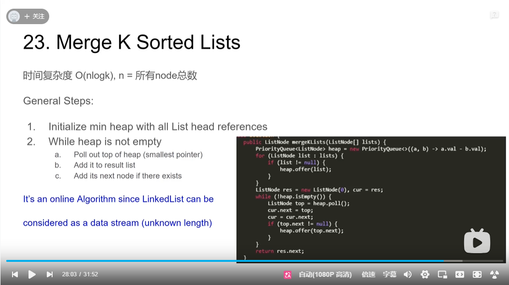

1.初始化一个小根堆存放所有链表的头结点

2.遍历所有链表的下一个节点 并放到小根堆中 从堆中依次取出头结点（即最小的节点）

```java
public ListNode mergeKLists(ListNode[] lists) {
    PriorityQueue<ListNode> queue = new PriorityQueue<ListNode>((a,b) -> a.val - b.val);
    for (int i = 0; i < lists.length; i++) {
        if (lists[i] != null) {
            queue.offer(lists[i]);
        }
    }
    //创建一个dummy  将当前指针指向dumm
    ListNode dummyHead = new ListNode(0),curr = dummyHead;
    while (!queue.isEmpty()) {
        ListNode top = queue.poll();
        curr.next=top;
        curr=curr.next;//注意将当前指针移动到下一个接节点
        if (top.next != null)
            queue.offer(top.next);
    }
    return dummyHead.next;
}
```

# 栈

### 739 每日温度

https://www.bilibili.com/video/BV1VN411J7S7?spm_id_from=333.788.videopod.sections&vd_source=746d8a251a4a658573b141cee21d4f94

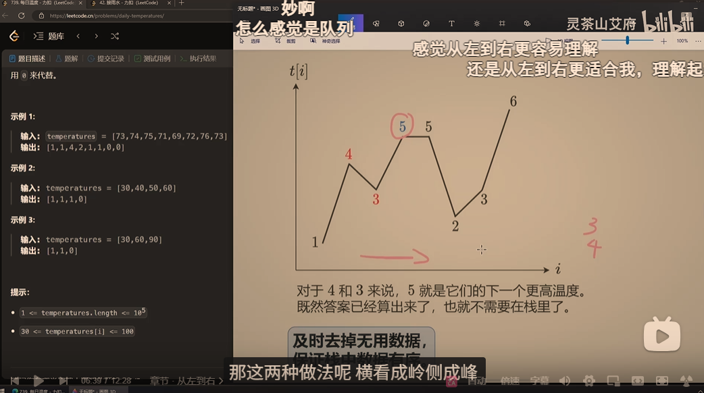

把这些高度想象成一座座山 从左往右看的时候 碰到比当前元素更高的就记录下来 同时把栈顶元素弹出来 把当前温度放进去 此时答案（天数）就是横坐标相减 

### 155 最小栈

在deque里面放一个数组进去 分别是当前数字和当前放进去的最小值 

```java
private final Deque<int []> st=new ArrayDeque<>();
//这里不用Stack类是因为它继承Vector 是同步的 影响性能
public MinStack() {
    st.push(new int[]{0,Integer.MAX_VALUE});//增加一个哨兵 不用每次pop都判断
}

public void push(int val) {
    st.push(new int[]{val,Math.min(st.peek()[1],val)});//每一步放进去当前值和目前最小值
}

public void pop() {
    st.pop();
}

public int top() {
    return st.peek()[0];
}

public int getMin() {
    return st.peek()[1];
}
```

### [394. 字符串解码](https://leetcode.cn/problems/decode-string/)

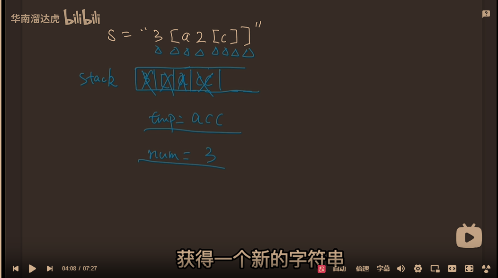

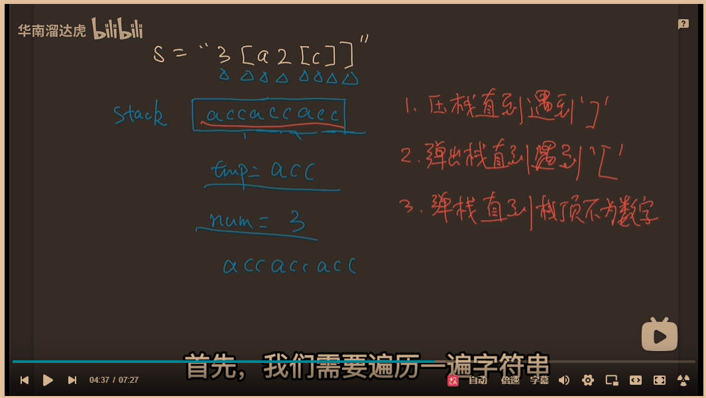

```java
public String decodeString(String s) {
    Deque<String> st = new ArrayDeque<>();
    for (int i = 0; i < s.length(); i++) {
        char c = s.charAt(i);
        if (c != ']') {
            st.push(String.valueOf(c));
        } else {
            // 1. 取出 [] 里面的字符串
            StringBuilder temp = new StringBuilder();
            while (!st.peek().equals("[")) {
                temp.insert(0, st.pop());
            }
            // 2. 弹出 [
            st.pop();
            // 3. 取出数字
            StringBuilder num = new StringBuilder();
            while (!st.isEmpty() && Character.isDigit(st.peek().charAt(0))) {
                num.insert(0, st.pop());
            }
            int cnt = Integer.parseInt(num.toString());
            // 4. 重复 temp cnt 次
            StringBuilder str = new StringBuilder();
            while (cnt > 0) {
                str.append(temp);
                cnt--;
            }
            // 5. 把解码后的字符串重新压入栈
            st.push(str.toString());
        }
    }
    // 6. 拼接最终结果
    StringBuilder res = new StringBuilder();
    while (!st.isEmpty()) {
        res.insert(0, st.pop());//注意这里的顺序，不要弄反了
    }
    return res.toString();
}
```

# 链表 

解题套路 两种1.快慢指针2.反转链表

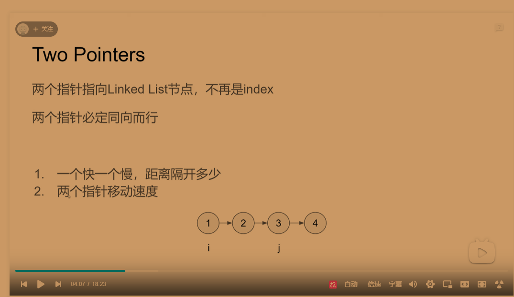

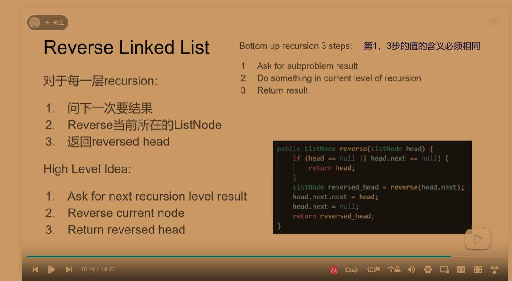

### 206 反转链表 

### 92 反转链表2

### 876 链表的中间节点

定义一快一慢两个指针指向头结点 快指针走2步 慢指针走1步 当快指针或快指针的下一步为空（走到头） 此时慢指针停留的位置就是中间节点

### 141 环形链表

定义一快一慢两个指针指向头结点 当快指针不为空并且快指针的下一个指针也不为空时 快指针走2步 慢指针走1步 如果快慢指针相遇则有环 反之则无环

```java
public boolean hasCycle(ListNode head) {
        
        ListNode slow = head;
        ListNode fast = head;
        while (fast!=null && fast.next!=null) {
            slow = slow.next;
            fast = fast.next.next;
            if (slow==fast) {
                return true;
            }
        }
        return false;
    }
```

### [142. 环形链表 II](https://leetcode.cn/problems/linked-list-cycle-ii/)

给定一个链表的头节点  `head` ，返回链表开始入环的第一个节点。 *如果链表无环，则返回 null。*

如果链表中有某个节点，可以通过连续跟踪 `next` 指针再次到达，则链表中存在环。 为了表示给定链表中的环，评测系统内部使用整数 `pos` 来表示链表尾连接到链表中的位置（**索引从 0 开始**）。如果 `pos` 是 `-1`，则在该链表中没有环。**注意：pos 不作为参数进行传递**，仅仅是为了标识链表的实际情况。

**不允许修改** 链表

此题需要返回入环的第一个节点

解法1：定义一个哈希表，遍历链表中每个节点并记录下来，如果遇到了遍历过的节点，该节点就是入环的第一个节点 如果全程没有遇到已经遍历过的节点，便无环，返回null

```java
public ListNode detectCycle(ListNode head) {
          ListNode pos=head;
        Set<ListNode> set=new HashSet<>();
        while (pos!=null){
            if(set.contains(pos)){
                return pos;
            }else  {
                set.add(pos);
                pos=pos.next;
            }
        }
        return null;
    }
```

解法2：定义一快一慢两个指针指向头结点，如果两指针相遇，一定会在入环的位置相遇，否则返回null（具体原因看视频）

### 237 删除链表中的节点

  

把下一个节点的值copy过来，然后把下一个节点删除 （神评：成为你，就是杀死我自己）

```java
public void deleteNode(ListNode node) {
    node.val = node.next.val;
    node.next = node.next.next;
}
```

### [19. 删除链表的倒数第 N 个结点](https://leetcode.cn/problems/remove-nth-node-from-end-of-list/)

用双指针，先让快指针走n个节点，然后慢指针走，此时快慢指针的相对距离就是n，当快指针走到头时，此时慢指针就是倒数第n个节点，删除该节点即可

什么时候用dummy node？在可能删掉头节点时用

```java
public ListNode removeNthFromEnd(ListNode head, int n) {
    ListNode dummy=new ListNode(0,head);
    ListNode l=dummy;
    ListNode r=dummy;

    for(int i=0;i<n;i++) {
        r=r.next;
    }
    while(r.next!=null) {
        l=l.next;
        r=r.next;
    }
    l.next=l.next.next;
    return dummy.next;
}
```

### [83. 删除排序链表中的重复元素](https://leetcode.cn/problems/remove-duplicates-from-sorted-list/)

初始化cur指向头结点，如果cur的下一个节点和当前cur的值相同，则将cur指向下下个节点（删除下一个节点），否则就移到下一个节点

```java
public ListNode deleteDuplicates(ListNode head) {
    if (head == null || head.next == null) {
        return head;
    }  //如果不加这个判断会空指针异常
    ListNode cur= head;
    while (cur.next != null) {
        if (cur.val == cur.next.val) {
            cur.next= cur.next.next;
        }else  {
            cur = cur.next;
        }
    }

    return head;
}
```

### [82. 删除排序链表中的重复元素 II](https://leetcode.cn/problems/remove-duplicates-from-sorted-list-ii/)

此题可能会用删除头节点所以需要用到dummy node

cur指向dummy

当cur下一个节点和下下节点的值相同时 嵌套循环 只要下一个节点还在并且值等于当前值 就将它删掉  

否则将cur移动到下一个节点

```java
public ListNode deleteDuplicates(ListNode head) {
    ListNode dummy=new ListNode(0,head);
    ListNode cur=dummy;
    while(cur.next!=null&&cur.next.next!=null){
        int value=cur.next.val;
        if(value==cur.next.next.val){
            while (cur.next!=null && cur.next.val==value){//只要下一个节点还在并且值等于当前值 就将它删掉  

                cur.next=cur.next.next;
            }

        }else {
            cur=cur.next;
        }
    }
    return dummy.next;
}
```

时间复杂度：虽然里面嵌套了循环 但是每次循环不是删掉就是跳过 所以时间复杂度还是O（n）的

空间复杂度 O（1）

### 138 随机链表的复制

https://www.bilibili.com/video/BV1qh1CY6EdY/?spm_id_from=333.1387.search.video_card.click&vd_source=746d8a251a4a658573b141cee21d4f94

用哈希表保存新旧节点的映射关系 

第一次遍历创建新节点

第二次遍历设置next和random指针指向

```java
HashMap<Node, Node> map = new HashMap<>();
Node cur = head;
while (cur != null) {
    map.put(cur, new Node(cur.val));
    cur = cur.next;
}
cur = head;
while (cur != null) {
    map.get(cur).next = map.get(cur.next);
    map.get(cur).random = map.get(cur.random);
    cur = cur.next;
}
return map.get(head);
```

### 24.两两交换链表中的节点

https://www.bilibili.com/video/BV1MJxWeBEt9/?spm_id_from=333.1387.search.video_card.click&vd_source=746d8a251a4a658573b141cee21d4f94


定义dummy node指向头结点   用pre和nxt记录下之前的节点和之后的节点  交换时 pre指向second  second指向first first指向nxt

交换完一轮后 移动两步继续交换

```java
public ListNode swapPairs(ListNode head) {
 ListNode dummy=new ListNode(0,head);
 ListNode prev=dummy;
 ListNode first=head;

 while(first!=null&&first.next!=null){
  ListNode second=first.next;
  ListNode nxt=second.next;

  prev.next=second;
  second.next=first;
  first.next=nxt;

  prev=first;
  first=nxt;//移动链表，注意这里是移动两步，即交换完的两步
 }
 return dummy.next;
}
```

### [86. 分隔链表](https://leetcode.cn/problems/partition-list/)

维护两个链表 small 和large 将小于x的节点放在small 里面 将大于x的值放在large里面 最后将small的尾节点指向large 断开large的尾节点

```java
ListNode small=new ListNode(0);
ListNode smallhead = small;//哑节点 方便处理头结点为空的边界条件
ListNode large=new ListNode(0);
ListNode largehead = large;
while (head != null) {
    if (head.val < x) {
        small.next = head;
        small=small.next;
    }else  {
        large.next = head;
        large=large.next;
    }
    head = head.next;
}
small.next = largehead.next;
large.next = null;
return smallhead.next;
```


# 二叉树

## BFS 广度优先搜索

利用queue记录每一层需要展开的树节点

1.定义一个queue，先将根节点放进去

2.当queue不为空的时候

遍历当前queue的每一个节点

取出元素加到结果

展开每一层，将子节点的每一层按顺序加入queue

将该层的节点加入结果

时间复杂度：O(n) 因为每个节点进出Queue一次

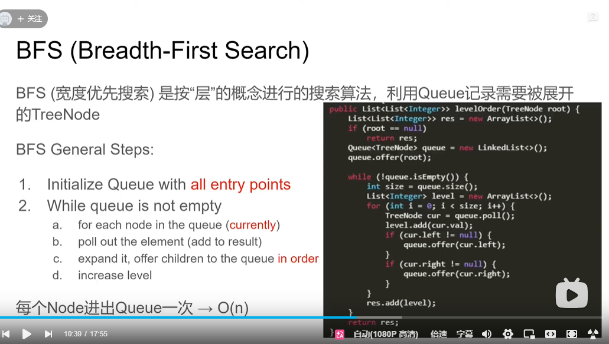


### 102 二叉树的层序遍历

关于用两个数组和队列的区别 可以看这个视频

https://www.bilibili.com/video/BV1hG4y1277i?spm_id_from=333.788.videopod.sections&vd_source=746d8a251a4a658573b141cee21d4f94

```java
if(root==null) return List.of();//如果是空直接返回 避免空指针
List<List<Integer>> res = new ArrayList<>();
ArrayDeque<TreeNode> q = new ArrayDeque<>();//ArrayDeque比解题讨论中的LinkedList更推荐
q.offer(root);
while (!q.isEmpty()){
    int size = q.size();
    List<Integer> level = new ArrayList<>();
    for (int i = 0; i < size; i++) {
        TreeNode node = q.poll();
        level.add(node.val);
        if(node.left!=null){
            q.offer(node.left);

        }
        if(node.right!=null){
            q.offer(node.right);
        }
    }
    res.add(level);
}
return res;
```

### 104 二叉树的最大深度

方法一：用BFS 展开每层 层数加1

方法二：用递归

```java
public int maxDepth(TreeNode root) {
    if (root == null) return 0;
    int left=maxDepth(root.left);
    int right=maxDepth(root.right);
    return Math.max(left,right)+1;//返回左右节点的最大深度+本节点
}
```

### 199 二叉树的右视图

方法一：用BFS 展开每层 每层先展开右节点，再展开左节点，这样每层的peak值就是右边的节点

```java
public List<Integer> rightSideView(TreeNode root) {
    if(root==null) return List.of();
    ArrayList<Integer> ans = new ArrayList<>();
    ArrayDeque<TreeNode> q = new ArrayDeque<>();
    q.offer(root);
    while (q.size()!=0){
        //注意这几步的顺序，循环里面的size是由当前queue的大小控制的
        int size=q.size();
        TreeNode peek = q.peek();
        ans.add(peek.val);  
        for(int i=0;i<size;i++){
            TreeNode cur = q.poll();
            if(cur.right!=null){//先从右边展开
                q.offer(cur.right);
            }
            if(cur.left!=null){
                q.offer(cur.left);
            }
        }
    }
    return ans;
}
```

方法二：用递归

### 513 找树左下角的值

这题可以用之前的层序遍历 取出答案数组中最后一层的第一个   也可以用左视图,取出数组中最后一个数字

但是这题只需要知道左下角的值 用BFS,先把右儿子入列,再把左儿子入列,这样最后一个出队的节点就是左下角的节点了

只需要知道每层最后一个节点,所以里面不用写二重循环,直接把这个节点出队 

注意这里是要找最后poll的值 所以要从右往左遍历 这样最后出来的就是左下角的值

```java
TreeNode node=root;
Deque<TreeNode> q= new ArrayDeque<TreeNode>();
//注意搞清楚root和node的区别
q.offer(root);
while(!q.isEmpty()){
    node= q.poll();
    if(node.right!=null){
        q.offer(node.right);
    }
    if(node.left!=null){
        q.offer(node.left);
    }
}
return node.val;
```


## DFS深度优先搜索

DFS分为前序、中序、后序

前序：根左右

中序：左根右

后续：左右根

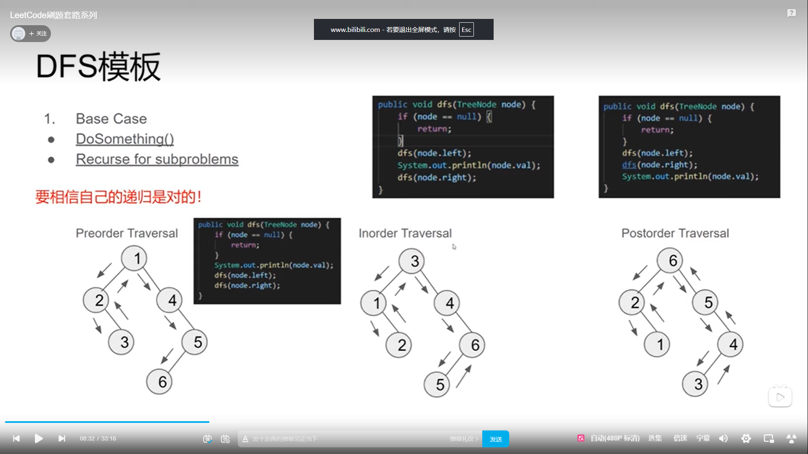

DFS有两个变种：从上往下 和从下往上

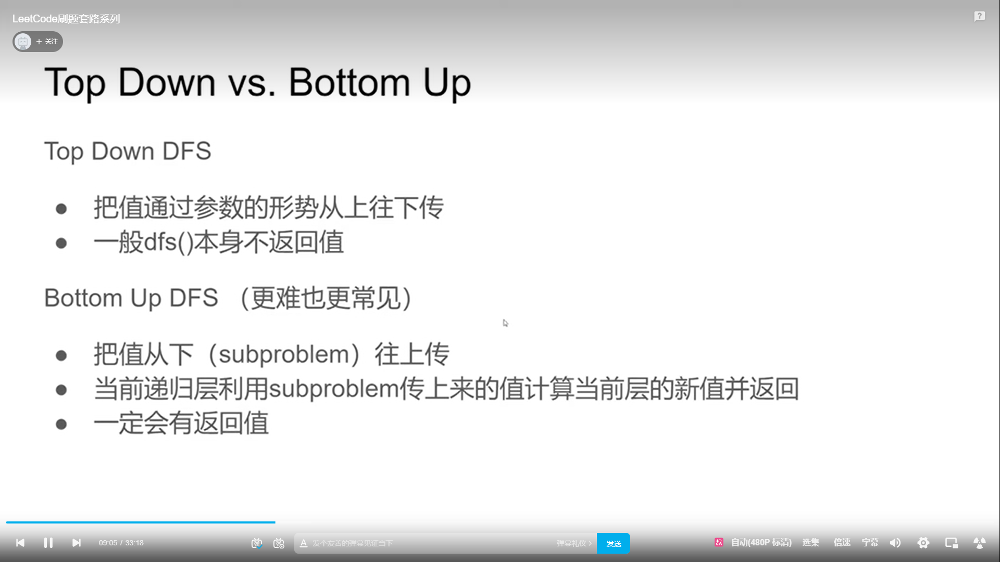

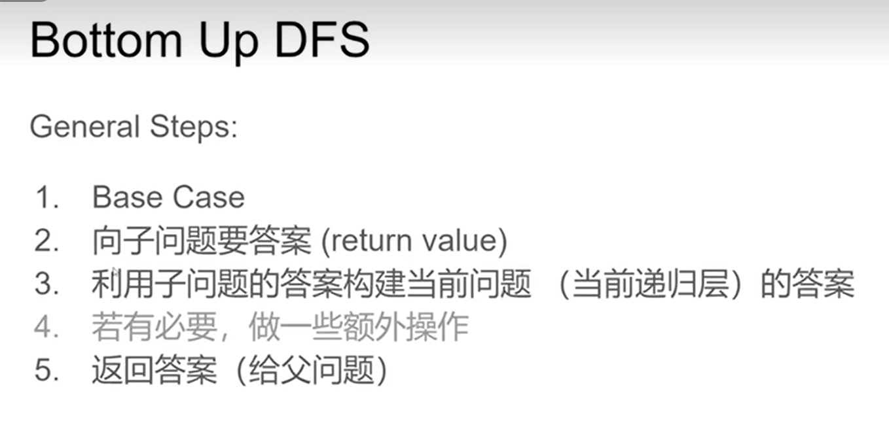


第二部步和第五步返回值的意义必须是一样的

找中间状态来思考问题

### 104 二叉树的最大深度

1.用BFS展开 每层记录层数

2.用DFS的 bottom up 也就是递归 

时空复杂度都是O（n） 因为计算机是用栈来实现递归的

### 124 二叉树的最大路劲和

每一层由左边的最大值和右边的最大值的最大值，然后加上当前节点

由于可能是负数，所以结果还要和0比较最大值

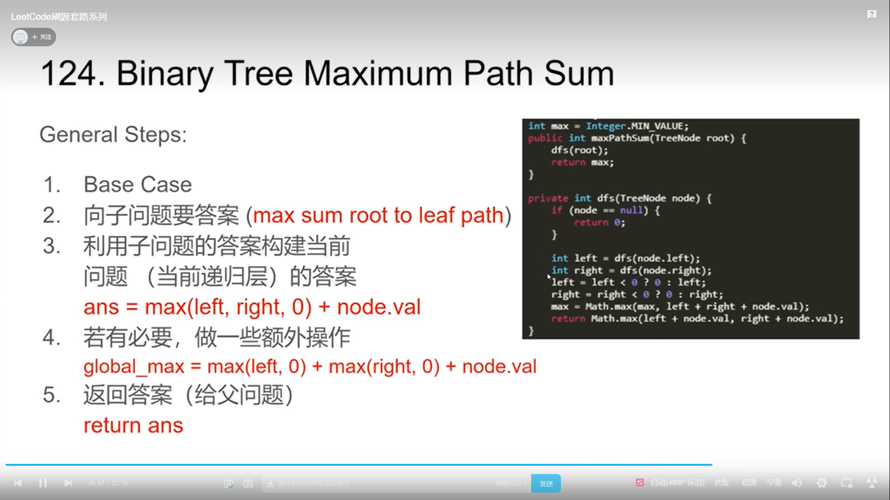

```java
public class maxPathSum {
    int max=Integer.MIN_VALUE;
    public int maxPathSum(TreeNode root) {
        //注意这里不能直接调用 因为递归过程中返回给父节点的值和题目最终要返回的答案不一样
       dfs(root);
       return max;
    }

    private int dfs(TreeNode node){
        if (node==null) return 0;
        int left=dfs(node.left);
        left=left>0?left:0;
        int right=dfs(node.right);
        right=right>0?right:0;
        max=Math.max(max,left+right+node.val);
        return Math.max(left+node.val,right+node.val);
    }

}
```

### 129 求根节点到叶节点数字之和

这是DFS的bottom down，拿到父节点的值然后往下传

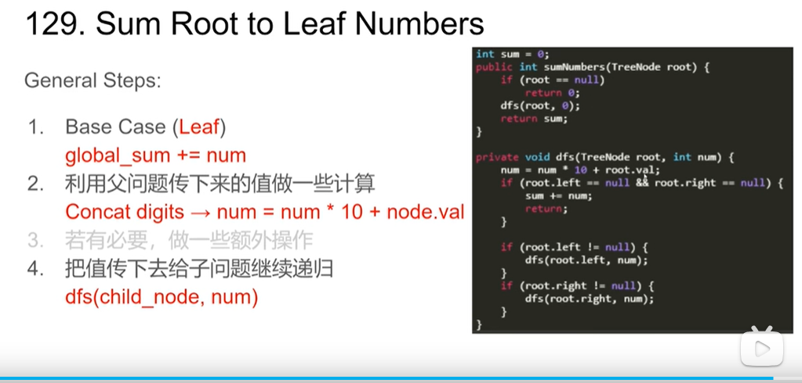

```java
public class sumNumbers {
    int sum=0;
    public int sumNumbers(TreeNode root) {
        if(root==null){
            return 0;}
        dfs(root,0);
        return sum;
    }

    //注意这里是没有返回值的   注意sum和num的区别
    private void dfs (TreeNode node,int num){
        //当遍历到最后的叶子节点时退出递归
        num=num*10+node.val;
            if(node.left==null&&node.right==null){
                sum+=num;
                return;
            }
                if(node.left!=null){
                    dfs(node.left,num);
                }
                if(node.right!=null){
                    dfs(node.right,num);
                }
    }
}
```

### 100  相同的树

用递归 判断两个节点的左节点和右节点是否都相等

```java
public boolean isSameTree(TreeNode p, TreeNode q) {
    if(p==null||q==null){
        return p==q;
    }
    return p.val==q.val&&isSameTree(p.left,q.left)&&isSameTree(p.right,q.right);
}
```

### 101 对称二叉树

这题和100很像，把递归过程左右节点交换就可以

```java
public boolean isSymmetric(TreeNode root) {
    return isSame(root.left,root.right);
}

boolean isSame(TreeNode l,TreeNode r){
    if(l==null||r==null){
        return l==r;
    }
    //不要漏了判断值  判断两个节点是否对称就是判断这两个节点值一样且节点1的左节点和节点2的右节点相等,节点1的右节点和节点2的左节点相等
    return l.val==r.val&& isSame(l.left,r.right)&&isSame(l.right,r.left);
}
```

### 98 验证二叉搜索树

这题可以从前序遍历,中序遍历,后序遍历三种不同的方法来写

https://www.bilibili.com/video/BV14G411P7C1?spm_id_from=333.788.player.switch&vd_source=746d8a251a4a658573b141cee21d4f94&trackid=web_related_0.router-related-2589621-2f2gz.1780172287162.493

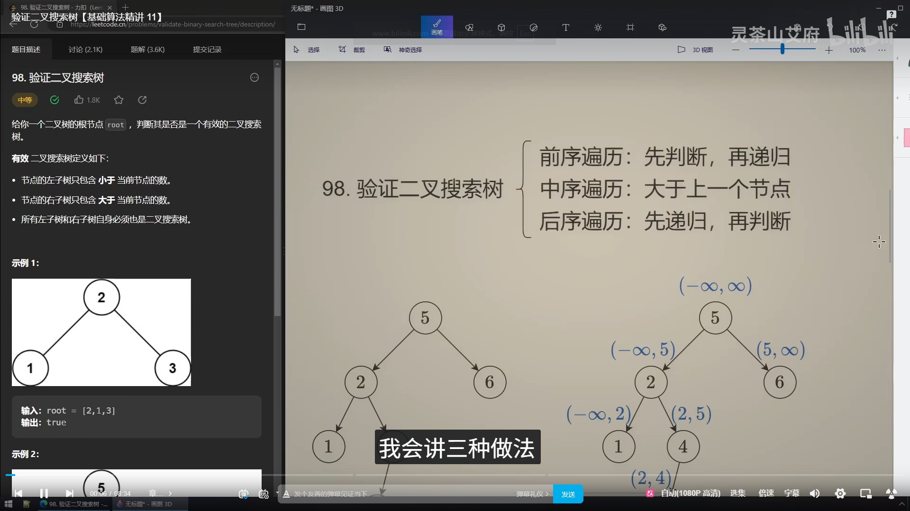

中序遍历

二叉搜索树的中序遍历是一个严格递增序列 中序遍历的结果就是树的投影

比较当前节点值和上一个节点值  当前节点值应该大于上一个节点值 并小于下一个节点值

记录当前节点值

```java
private long pre=Long.MIN_VALUE;//根节点之前的值

public boolean isValidBST(TreeNode root) {
   if (root == null) return true;
   if (!isValidBST(root.left)){
       return false;
   }
   if (root.val<=pre){
       return false;
   }
   pre=root.val;
   return isValidBST(root.right);
}
```

### 236 二叉树的最近公共祖先

https://www.bilibili.com/video/BV1W44y1Z7AR?spm_id_from=333.788.videopod.sections&vd_source=746d8a251a4a658573b141cee21d4f94

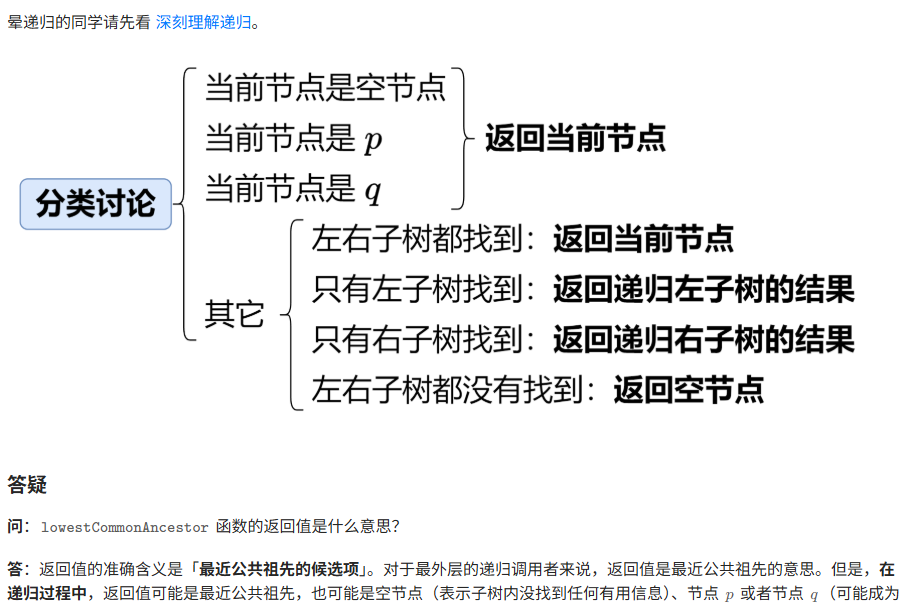

分类讨论应该返回的东西

### 235 二叉搜索树的最近公共祖先

二叉搜索树是二叉树的一个特例  所以也可以用236题的通用方法做, 也可以利用二叉树的性质,效率更高

利用二叉搜索树的性质:当前节点左边的节点比他小 右边的节点比他大

分类讨论:当前节点值root 如果p<root  那么p在左子树中

如果q>root q在右子树中 返回当前节点

如果p,q都小于root  那么返回左子树的结果

如果p,q都大于root  那么返回右子树的结果

base case 如果是空直接返回当前节点

```java
int val = root.val;
//p,q都在左子树
if (p.val < val&&q.val < val){
    return lowestCommonAncestor(root.left,p,q);
}
//p,q都在右子树
if (p.val > val&&q.val > val){
    return lowestCommonAncestor(root.right,p,q);
}
//其他
return root;
```

### 94 二叉树的中序遍历

```java
public List<Integer> inorderTraversal(TreeNode root) {
    List<Integer> res=new ArrayList<>();
    dfs(root,res);
    return res;
}

void dfs(TreeNode node,List<Integer> ans){
    if(node==null){
        return;
    }
    dfs(node.left,ans);
    ans.add(node.val);//这句写在前面就是前序遍历,写在后面就是后续遍历
    dfs(node.right,ans);
}
```

### 108.将有序数组转换为二叉搜索树

https://www.bilibili.com/video/BV1ygb9zjEfo/?spm_id_from=333.1387.search.video_card.click&vd_source=746d8a251a4a658573b141cee21d4f94

利用二叉树和平衡树的性质 尽可能的把中间的值放在根节点 把比中间值小的点放在左节点 大的放在右节点

```java
public TreeNode sortedArrayToBST(int[] nums) {
    TreeNode tree=buildTree(nums,0,nums.length-1);
    return tree;
}

TreeNode buildTree(int [] nums,int left,int right){
    if(left>right){
        return null;
    }
    int mid=left+(right-left)/2;
    TreeNode root = new TreeNode(nums[mid]);
    root.left=buildTree(nums,left,mid-1);
    root.right=buildTree(nums,mid+1,right);
    return root;
}
```

### 114 二叉树展开为链表

https://www.bilibili.com/video/BV1nW4RzzERW/?spm_id_from=333.1387.search.video_card.click&vd_source=746d8a251a4a658573b141cee21d4f94

最简单的解法:先对二叉树进行先序遍历  节点存在数组里面 然后遍历数组,把它的右指针穿起来,然后把左指针置空

```java
public void flatten(TreeNode root) {
    List<TreeNode> list=new ArrayList<>();
    preorderdfs(root,list);
    TreeNode cur=root;
    int size = list.size();
    //注意这里的i是从1开始的  因为cur此时已经在第0个节点上了
    for (int i = 1; i < size; i++) {
        cur.right=list.get(i);
        cur.left=null;
        cur=list.get(i);//把cur移动到刚刚链接的新节点
    }
}

private void preorderdfs(TreeNode root,List<TreeNode> list) {
    if (root==null) return;
    list.add(root);
    preorderdfs(root.left,list);
    preorderdfs(root.right,list);
}
```

### 105 从前序与中序遍历构造二叉树

https://www.bilibili.com/video/BV1XAYke2ETp/?spm_id_from=333.1387.search.video_card.click&vd_source=746d8a251a4a658573b141cee21d4f94

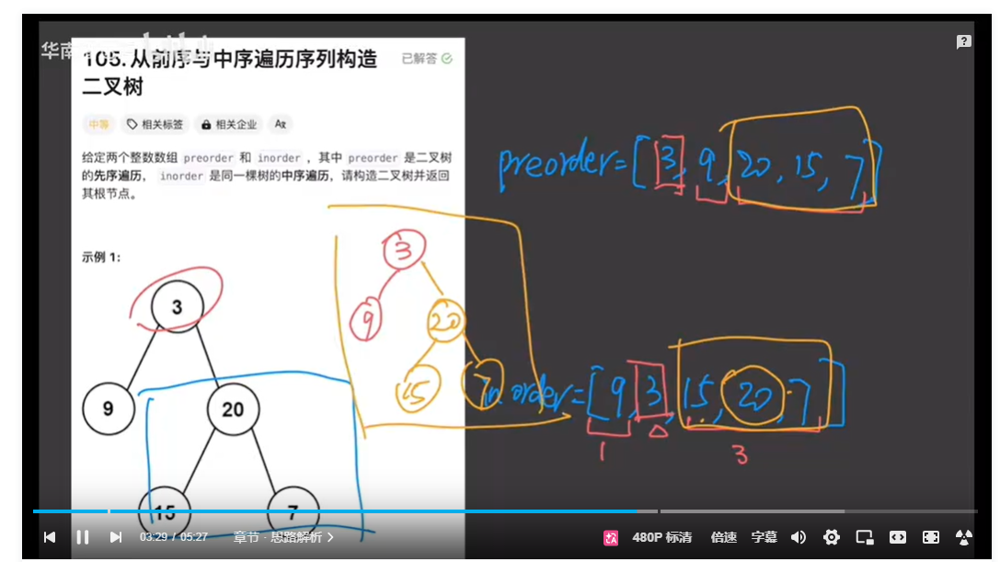

前序遍历的第一个节点一定是根节点  找到跟节点在中序数组中的位置  前面到根节点的就是左子树 根节点到右边的就是右子树

```java
public TreeNode buildTree(int[] preorder, int[] inorder) {
    if (preorder.length == 0 || inorder.length == 0)
        return null;
    //找到前序中根节点在中序中的位置
    int index=0;
    for (int i = 0; i < inorder.length; i++) {
        if (inorder[i] == preorder[0]) {
            index = i;
            break;
        }
    }
    TreeNode root = new TreeNode(inorder[index]);
    //找到左子树的前序遍历和中序遍历
    int [] prel= Arrays.copyOfRange(preorder,1,index+1);
    int [] inl=Arrays.copyOfRange(inorder,0,index);
    //找到右子树的前序遍历和中序遍历
    int [] prer= Arrays.copyOfRange(preorder,index+1,inorder.length);
    int [] inr=Arrays.copyOfRange(inorder,index+1,inorder.length);
    //构建左子树
    root.left= buildTree(prel,inl);
    //构建右子树
    root.right= buildTree(prer,inr);
    //返回根节点
    return root;

}
```

### 230 二叉搜索树第k小的元素

https://www.bilibili.com/video/BV1DseseYE38/?spm_id_from=333.1387.search.video_card.click&vd_source=746d8a251a4a658573b141cee21d4f94

对二叉搜索树进行中序遍历  得到的是一个升序数组 所以这题可以转化成求升序数组中第k小的元素 题目要求从1开始计数 所以是找索引为k-1的元素

```java
List<TreeNode> list=new ArrayList<TreeNode>();
public int kthSmallest(TreeNode root, int k) {
  inorderdfs(root,list);
  return list.get(k-1).val;
}

//中序遍历
private  void inorderdfs(TreeNode root, List<TreeNode> list) {
    if (root == null)
        return;
    inorderdfs(root.left,list);
    list.add(root);
    inorderdfs(root.right,list);
}
```

### 437 路径总和3

https://www.bilibili.com/video/BV18XtHzeEUu/?spm_id_from=333.1387.search.video_card.click&vd_source=746d8a251a4a658573b141cee21d4f94

```java
public int pathSum(TreeNode root, int targetSum) {
    if (root == null)
        return 0;
    //注意 这里是dfs和pathSum
    return dfs(root,targetSum)+pathSum(root.left,targetSum)+pathSum(root.right,targetSum);
}

private int dfs(TreeNode root, long targetSum) {
    if (root == null)
        return 0;
    //如果当前节点的值刚好等于剩余目标值 说明找到一条合法路径
    int count=root.val==targetSum?1:0;
    //当前节点已经使用 剩余目标值需要减去当前节点的值 然后继续向左子树寻找
    count +=dfs(root.left,targetSum-root.val);
    //同理 继续向右子树寻找
    count+=dfs(root.right,targetSum-root.val);
    //返回当前起点对应的合法路径数量
    return count;
}
```

# 回溯

# 图

# 位运算

# 数学

# 矩阵

# 哈希表 

# 区间

# 贪心算法

# 代办

1.三数之和里面

如果这里用变量int num接收就不对，还不知道为什么

